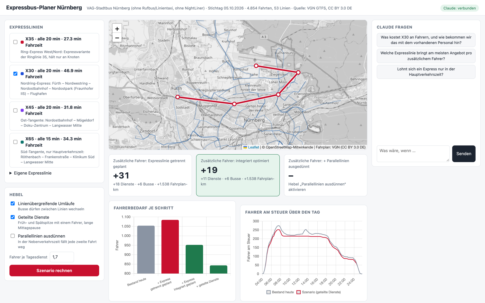

# Expressbusse trotz Fahrermangel



Prototyp für das **Claude Code Impact Lab Nürnberg** (Hackathon #2, 05.10.2026, Fraunhofer IIS), Track 1:
Nürnberg hat genug Busse für zusätzliche Expresslinien, aber zu wenige Fahrer. Wie bekommt man neue Expresslinien
mit möglichst wenig zusätzlichem Personal auf die Straße?

**Idee:** Eine Expresslinie kostet nicht „Fahrzeit × Fahrer“. Wenn man sie *zusammen mit dem Bestand* plant,
füllt sie Lücken in vorhandenen Umläufen und Diensten. Der Prototyp rechnet das für den echten VAG-Busfahrplan durch
und zeigt, wie viele Fahrer eine Expresslinie wirklich zusätzlich kostet, und welche Hebel diese Zahl drücken.

> **In English:** Prototype for the Claude Code Impact Lab Nuremberg (hackathon, 5 Oct 2026, Fraunhofer IIS), Track 1
> “Express buses despite a driver shortage”. Using the real VAG city bus timetable (VGN GTFS, 4,854 trips, 53 lines),
> it plans vehicle blocks (min-cost flow) and driver duties (CP-SAT, OR-Tools) and shows how many extra drivers a new
> express line really needs when it is planned *together with* the existing network. Example X30: 31 extra drivers if
> planned separately, 19 when integrated, 12 with thinned-out parallel lines off-peak. Claude (Opus 5.5) acts as a
> scenario assistant that runs the optimiser via tool calls and explains the results. Run it with
> `uv sync && uv run uvicorn expressbus.api:app --port 8000`.

## Schnellstart

```bash
uv sync
uv run uvicorn expressbus.api:app --port 8000
```

Dann http://localhost:8000 öffnen. Für den Claude-Chat vorher `export ANTHROPIC_API_KEY=…` setzen
(auf dem Event: 100 $ Guthaben pro Person).

Die Rohdaten liegen nicht im Repo. Neu aufbauen:

```bash
curl -L -o data/raw/vgn_gtfs.zip https://www.vgn.de/opendata/GTFS.zip && unzip -o -q data/raw/vgn_gtfs.zip -d data/raw/vgn_gtfs
uv run python scripts/build_dataset.py 20261005
```

## Aufbau

| Datei | Inhalt |
|---|---|
| `scripts/build_dataset.py` | VGN-GTFS → VAG-Stadtbus am Stichtag (4.854 Fahrten, 53 Linien, Mo 05.10.2026) |
| `expressbus/scheduling.py` | **Umlaufplanung** (Min-Cost-Flow, OR-Tools) und **Dienstplanung** (Schnitt per DP in mehreren Mustern, Paarung per CP-SAT, Multistart) |
| `expressbus/scenario.py` | Expresslinien aus Haltestellenfolge + Takt bauen (Fahrzeiten aus dem Bestandsfahrplan), Hebel, Treppe und Grenzkosten |
| `expressbus/explainer.py` | Claude (`claude-opus-5-5`) als Szenario-Erklärer mit Werkzeugen `find_stops`, `list_lines`, `list_presets`, `run_scenario` |
| `expressbus/api.py` | FastAPI-Backend |
| `web/index.html` | Demo: Karte, Szenario-Baukasten, Kennzahlen, Diagramme, Chat |

## Was herauskommt (Stand Vorbereitung)

Beispiel X30 „Nordring-Express“ Fürth Hbf – Nordwestring – Nordostbahnhof – Nordostpark – Flughafen, alle 20 min, 06–20 Uhr:

| Planung | zusätzliche Dienste | zusätzliche Fahrer (× 1,7) |
|---|---|---|
| getrennt (eigene Busse, eigene Dienste) | +18 | +31 |
| integriert optimiert (gegenüber gleich optimiertem Bestand) | +11 | +19 |
| + Parallellinien 30/35/39 in der Nebenverkehrszeit ausgedünnt | +7 | +12 |

Dazu kommen die Hebel im Bestand (Modellannahme „heute linienrein, ohne geteilte Dienste“):
linienübergreifende Umläufe und geteilte Dienste sparen rechnerisch über 100 Dienste und damit ein Vielfaches
dessen, was eine Expresslinie kostet. **Achtung:** Was die VAG heute schon nutzt, wissen wir nicht. Diese Zahl ist
eine Frage an die Fraunhofer-/VAG-Leute, keine Behauptung.

Erkenntnis für den Pitch: Den Fahrerbedarf bestimmt die **Spitzenzeit**. Ausdünnen in der Nebenverkehrszeit spart
Fahrplanstunden, aber wenig Dienste. Expressfahrten außerhalb der Spitze sind fast „gratis“, wenn sie Lücken füllen.

## Annahmen und Grenzen

- Bestand = Modellrechnung aus dem Soll-Fahrplan (GTFS), nicht die echte VAG-Umlauf- und Dienstplanung.
- Leerfahrten: Luftlinie × 1,3 bei 22 km/h; ein virtuelles Depot mit 15 min Aus- und Einrücken.
- Dienste: höchstens 2 Stücke, Stück ≤ 4,5 h, Pause ≥ 30 min, Arbeitszeit ≤ 9 h, Schicht ≤ 10 h
  (geteilt: Pause ≥ 2 h, Schicht ≤ 12,5 h), 10 + 5 min Dienstbeginn/-ende, 20 min Wegezeit Depot ↔ Ablösepunkt.
  Alles in `Params` einstellbar, kein vollständiges Tarifwerk (TV-N Bayern).
- Fahrer = Dienste × 1,7 (7-Tage-Betrieb, Urlaub, Krankheit), Werktag als Stichtag.
- Expresslinien-Fahrzeit: aus Bestandsfahrten zwischen den Halten, minus 0,6 min je ausgelassenem Halt;
  ohne Direktverbindung geschätzt (Luftlinie × 1,35 bei 22 km/h). Auf der Karte als Luftlinie gezeichnet.
- Laufzeit: ca. 12 s je Plan, ca. 45 s je Szenario-Vergleich (Ergebnisse werden im Prozess gecacht).

## Ideen für Montag (im Team)

1. Mit Fraunhofer/VAG klären: Was ist heute Praxis (Interlining, geteilte Dienste, Ablösepunkte, Depots)? Basis kalibrieren.
2. Nachfrage dazunehmen (z. B. Pendlerströme, VGN-Fahrgastzahlen, falls verfügbar) → welche Expresslinie lohnt sich?
3. Expresslinie automatisch vorschlagen lassen: Claude schlägt Tangenten vor, der Optimierer bewertet sie.
4. Dienstplanung genauer machen: 3-Stück-Dienste, echte Ablösepunkte, Column Generation.
5. Fahrplan-Feinjustierung: Abfahrten um ±2 min verschieben, damit Umläufe und Dienste besser passen.
6. Wochenende und Ferien: weitere Stichtage rechnen.

Daten: VGN – Verkehrsverbund Großraum Nürnberg GmbH, Soll-Fahrplandaten (GTFS), CC BY 3.0 DE.

Code: MIT-Lizenz, siehe [LICENSE](LICENSE). Die VGN-Daten in `data/processed/` stehen weiter unter CC BY 3.0 DE.
Karte: © OpenStreetMap-Mitwirkende.
